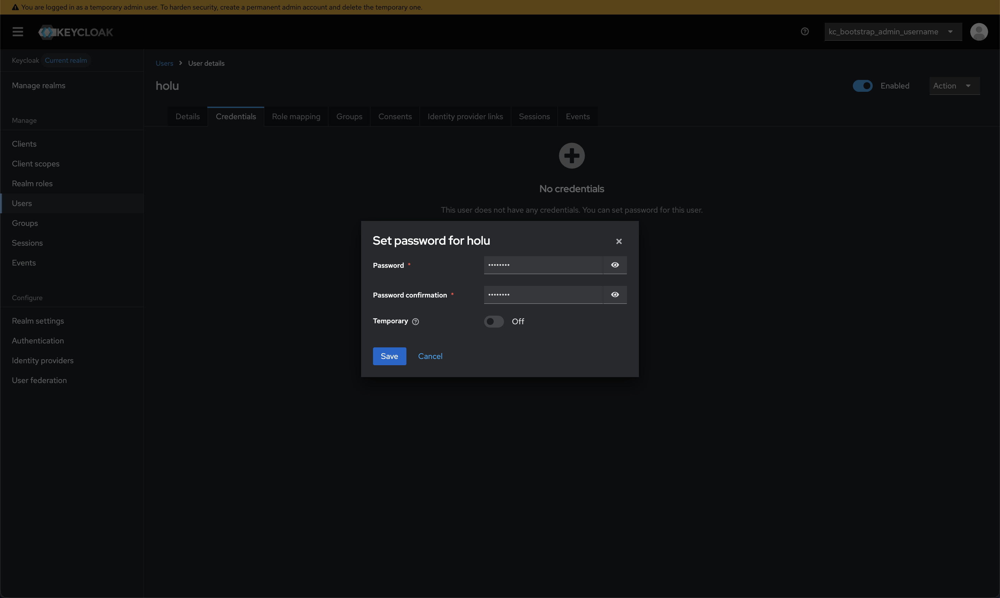
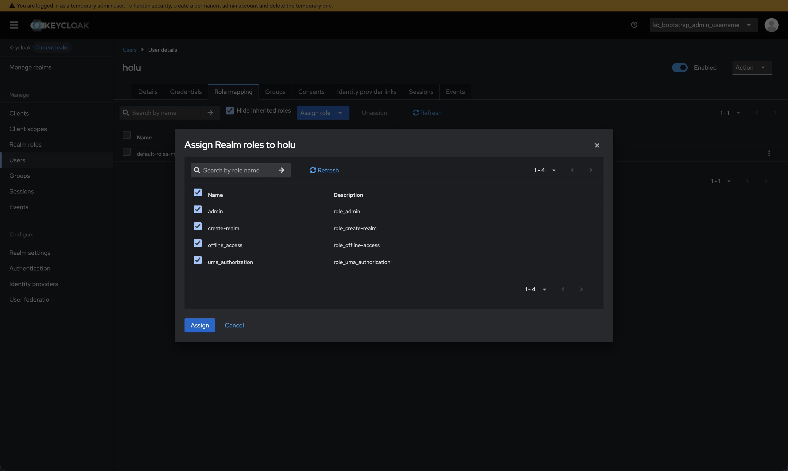

## Introduction

In this tutorial, you will learn how to install [Traefik](https://traefik.io/traefik) as a reverse proxy for [Keycloak](https://www.keycloak.org/) on an Ubuntu server. Keycloak is an open-source identity and access management solution that provides features such as [single sign-on (SSO)](https://en.wikipedia.org/wiki/Single_sign-on), user federation, and social login. Traefik will handle incoming requests, manage SSL certificates using [Let's Encrypt](https://letsencrypt.org/) with Cloudflare DNS challenge (supporting wildcard certificates), and route traffic to the Keycloak service. In addition, we will make the Traefik web dashboard publicly available and protect it with Keycloak authentication through [forward auth](https://github.com/thomseddon/traefik-forward-auth).

**Prerequisites**

- Make sure you are logged in with a user with sudo access on the server.
- A domain with Domain Name System (DNS) management access and the required DNS records:
  - A record with `<example.com>` pointing to your server's IP address (for Keycloak)
  - A record with `<sub.example.com>` pointing to your server's IP address (for the Traefik Dashboard - optional)
  - A record with `forwardauth.<example.com>` pointing to your server's IP address (for forward auth - optional)
- API credentials for your DNS provider with DNS edit permissions. This tutorial uses Cloudflare, but any [supported DNS provider](https://go-acme.github.io/lego/dns/) will work (we'll create the API token in Step 2.6)
- Docker packages installed on the server. If you haven't installed them yet, you can run:
  ```bash
  curl -fsSL https://get.docker.com -o get-docker.sh
  sh get-docker.sh
  ```
  or follow the [official guide](https://docs.docker.com/engine/install/ubuntu/#install-using-the-repository).
## Step 1 - Setup Hetzner Cloud Firewall

To ensure the security of your server, it's essential to configure a firewall that allows only the necessary traffic. In this step, we will set up a Hetzner Cloud Firewall to permit traffic on specific ports required for Keycloak and Traefik.

### Step 1.1 - Create a New Firewall

Go to your project in the [Hetzner Cloud Console](https://console.hetzner.cloud/), where your server is located. Navigate to the "Firewalls" section and click on "Create Firewall".

We need to allow the following ports:
- **SSH (Port 22)**: Required for SSH access to the server.
- **HTTP (Port 80)**: Required for the HTTP to HTTPS redirection.
- **HTTPS (Port 443)**: Required for secure access to Keycloak and the Traefik dashboard.

You can apply the firewall to your existing server by selecting it in the "Apply to" section.

Now you can give your firewall a name, such as "Keycloak-Traefik-Firewall", and click on "Create Firewall".

## Step 2 - Setup Traefik

To access Keycloak via a domain name and secure the connection with SSL, we’ll set up Traefik as a reverse proxy. Traefik will handle incoming requests, manage SSL certificates using Let's Encrypt, and route traffic to the Keycloak service.

### Step 2.1 - Create Necessary Directories and Files

First, we need to create the necessary directories for Traefik and Keycloak configurations. You can do this by running the following commands:

```bash
mkdir -p ~/traefik/{config,data}
```

Next, we will create a `docker-compose.yaml` file for Traefik and the `traefik.yaml` for configuration.

```bash
touch ~/traefik/docker-compose.yaml ~/traefik/config/traefik.yaml
```

### Step 2.2 - Create Traefik Docker Compose File

Now, open the `docker-compose.yaml` file with your preferred text editor:

```bash
nano ~/traefik/docker-compose.yaml
```
If nano is not installed, you can use `vim` or install it with `sudo apt install nano`.

```yaml
---
services:
  traefik:
    image: traefik:3
    container_name: traefik
    ports:
      - "80:80" # The HTTP port
      - "443:443" # The HTTPS port for encrypted traffic
    volumes:
      - /var/run/docker.sock:/var/run/docker.sock:ro # Allows Traefik to look for labels on containers to configure routing automatically
      - ./config/traefik.yaml:/etc/traefik/traefik.yaml:ro # Traefik configuration file
      - ./data/certs/:/var/traefik/certs/:rw # Directory to store SSL certificates from Let's Encrypt
    networks:
      - frontend # Network for traffic between Traefik and the services that it exposes
    restart: unless-stopped # Automatically restart the container unless it is explicitly stopped

networks:
  frontend:
    external: true # Make network external so we can use it for Keycloak as well
```

Create the external network we referenced in the `docker-compose.yaml` file:

```bash
sudo docker network create frontend
```

### Step 2.3 - Create Traefik Configuration

The next step is to configure Traefik by editing the `traefik.yaml` file. This file will contain the necessary settings for entry points, SSL configuration, and other options.

We will configure two entry points: one for HTTP (port 80) and one for HTTPS (port 443). We will also set up a redirection from HTTP to HTTPS to ensure secure connections.

Now, open the `traefik.yaml` file with your preferred text editor:

```bash
nano ~/traefik/config/traefik.yaml
```

Add the following configuration to the `traefik.yaml` file:

```yaml
entryPoints:
  web:
    address: ":80"
    # Redirect all HTTP traffic to HTTPS
    http:
      redirections:
        entryPoint:
          to: websecure
          scheme: https

  websecure:
    address: ":443"
```

### Step 2.4 - Configure SSL

Next, we will configure Traefik to use Let's Encrypt for SSL certificate management. We'll use DNS challenge, which allows us to obtain wildcard certificates.

> **Note:** This tutorial demonstrates the setup with Cloudflare and Hetzner DNS as examples. If your domain is managed by a different provider, you can use any of the [supported DNS providers listed here](https://go-acme.github.io/lego/dns/). The configuration steps are similar you'll just need to use the appropriate provider name and credentials for your DNS service.

Add the following to the end of the `traefik.yaml` file:

```bash
nano ~/traefik/config/traefik.yaml
```

**For Cloudflare:**

```yaml
certificatesResolvers:
  letsencrypt:
    acme:
      email: <your-email@example.com>
      storage: /var/traefik/certs/acme.json
      dnsChallenge:
        provider: cloudflare
        resolvers:
          - "1.1.1.1:53"
          - "8.8.8.8:53"
```

**For Hetzner DNS:**

```yaml
certificatesResolvers:
  letsencrypt:
    acme:
      email: <your-email@example.com>
      storage: /var/traefik/certs/acme.json
      dnsChallenge:
        provider: hetzner
        resolvers:
          - "1.1.1.1:53"
          - "8.8.8.8:53"
```

> Replace `<your-email@example.com>` with your actual email address.

The DNS challenge requires an API token from your DNS provider. We'll add this in the next steps.

### Step 2.5 - Add Docker Provider to Traefik Configuration

So that we can manage routing to Keycloak and other services that run through Docker, we need to add the Docker provider to the Traefik configuration.

This allows us to use Docker labels to define routing rules for our services.

Add the following to the end of the `traefik.yaml` file:

```bash
nano ~/traefik/config/traefik.yaml
```

```yaml
providers:
  docker:
    endpoint: "unix:///var/run/docker.sock"
    exposedByDefault: false
```

### Step 2.6 - Add DNS Provider API Token

For the DNS challenge to work, we need to provide Traefik with an API token from your DNS provider.

#### Step 2.6.1 - Create API Token

**For Cloudflare:**

1. Go to [Cloudflare Dashboard](https://dash.cloudflare.com/) → My Profile → API Tokens
2. Click "Create Token"
3. Use the "Edit zone DNS" template
4. Set the zone resources to your domain
5. Create the token and copy it

**For Hetzner DNS:**

1. Go to [Hetzner DNS Console API token](https://dns.hetzner.com/settings/api-token)
2. Give it a name (e.g., "Traefik-ACME")
3. Click "Create access token" and copy the token

#### Step 2.6.2 - Configure Environment Variable

Now, edit the Traefik docker-compose file to add the environment variable:

```bash
nano ~/traefik/docker-compose.yaml
```

Add the environment section to the traefik service. Use the appropriate variable for your DNS provider:

```yaml
services:
  traefik:
    image: traefik:3
    container_name: traefik
    ports:
      - "80:80"
      - "443:443"
    volumes:
      - /var/run/docker.sock:/var/run/docker.sock:ro
      - ./config/traefik.yaml:/etc/traefik/traefik.yaml:ro
      - ./data/certs/:/var/traefik/certs/:rw
    environment:
      - CF_DNS_API_TOKEN=${CF_DNS_API_TOKEN}        # For Cloudflare
      # - HETZNER_API_KEY=${HETZNER_API_KEY}        # For Hetzner DNS (uncomment if using Hetzner)
    networks:
      - frontend
    restart: unless-stopped
```

> Choose either `CF_DNS_API_TOKEN` for Cloudflare or `HETZNER_API_KEY` for Hetzner DNS. Comment out the one you don't use.

#### Step 2.6.3 - Create Environment File

Create a `.env` file in the traefik directory:

```bash
nano ~/traefik/.env
```

Add your DNS provider API token:

**For Cloudflare:**

```env
CF_DNS_API_TOKEN=<your-cloudflare-api-token>
```

**For Hetzner DNS:**

```env
HETZNER_API_KEY=<your-hetzner-api-key>
```

> Replace the placeholder with the actual API token you created from your DNS provider.

### Step 2.7 - Start Traefik

Now that we have configured Traefik, we can start it using Docker Compose.
Navigate to the Traefik directory and run the following command:

```bash
cd ~/traefik
```

And then start Traefik:

```bash
sudo docker compose up -d
```

This will start the Traefik container in detached mode, which means it will run in the background and you can continue using your terminal without stopping Traefik.

To check if Traefik is running correctly, you can use the following command:

```bash
sudo docker ps
```

You should see the Traefik container listed in the output.

## Step 3 - Setup Keycloak

### Step 3.1 - Create Necessary Directories and Files

First, we need to create the necessary directories for Keycloak configurations. You can do this by running the following commands:

```bash
mkdir ~/keycloak
```

Next, we will create a `docker-compose.yaml` and `.env` file for Keycloak.

```bash
touch ~/keycloak/docker-compose.yaml ~/keycloak/.env
```

### Step 3.2 - Edit Docker Compose File

Now, open the `docker-compose.yaml` file with your preferred text editor:

```bash
nano ~/keycloak/docker-compose.yaml
```

Add the following configuration to the `docker-compose.yaml` file:

```yaml
---
services:
  postgres:
    image: postgres:17
    container_name: postgres
    environment:
      - POSTGRES_DB=${POSTGRES_DB}
      - POSTGRES_USER=${POSTGRES_USER}
      - POSTGRES_PASSWORD=${POSTGRES_PASSWORD}
    volumes:
      - ./postgres_data:/var/lib/postgresql/data
    networks:
      - keycloak

  keycloak:
    image: quay.io/keycloak/keycloak:26.0.0
    environment:
      - KC_DB=postgres
      - KC_DB_USERNAME=${POSTGRES_USER}
      - KC_DB_PASSWORD=${POSTGRES_PASSWORD}
      - KC_DB_URL_HOST=postgres
      - KC_DB_URL_PORT=5432
      - KC_DB_URL_DATABASE=${POSTGRES_DB}
      - KC_BOOTSTRAP_ADMIN_USERNAME=${KC_BOOTSTRAP_ADMIN_USERNAME}
      - KC_BOOTSTRAP_ADMIN_PASSWORD=${KC_BOOTSTRAP_ADMIN_PASSWORD}
      - KC_HOSTNAME=${KC_HOSTNAME}
      - KC_PROXY_HEADERS=xforwarded
      - KC_HTTP_ENABLED=true
    networks:
      - keycloak
      - frontend
    command: ['start']
    labels:
      - traefik.enable=true
      - traefik.http.routers.keycloak.tls=true
      - traefik.http.routers.keycloak.tls.certresolver=letsencrypt
      - traefik.http.routers.keycloak.entrypoints=websecure
      - traefik.http.routers.keycloak.rule=Host(`${KC_HOSTNAME}`)
      - traefik.http.services.keycloak.loadbalancer.server.port=8080

networks:
  keycloak:
  frontend:
    external: true # Same network as defined in the Traefik docker-compose.yaml
```

### Step 3.3 - Create Environment File

Now, open the `.env` file with your preferred text editor:

```bash
nano ~/keycloak/.env
```

Add the following environment variables to the `.env` file, replacing the placeholders with your desired values:

```bash
POSTGRES_DB=keycloak
POSTGRES_USER=keycloak
POSTGRES_PASSWORD=<your-secure-password>
KC_HOSTNAME=<example.com>
KC_BOOTSTRAP_ADMIN_USERNAME=bootstrap_admin
KC_BOOTSTRAP_ADMIN_PASSWORD=<your-secure-admin-password>
```

> Make sure to replace `<your-secure-password>`, `<example.com>`, and `<your-secure-admin-password>` with your actual values.

### Step 3.4 - Start Keycloak

Now that we have configured Keycloak, we can start it using Docker Compose.
Navigate to the Keycloak directory and run the following command:

```bash
cd ~/keycloak
```

And then start Keycloak:

```bash
sudo docker compose up -d
```

You can check if Keycloak is running correctly by using the following command:

```bash
sudo docker ps
```

You should see the Keycloak and Postgres containers listed in the output.

Now you can access the Keycloak admin console by navigating to `https://<example.com>` in your web browser. Log in using the admin username and password you set in the `.env` file.

### Step 3.5 - Create Admin User

If you logged in successfully, you will see a yellow banner at the top of the page indicating to create a new Admin user.


To do so, go to "Users" in the left sidebar, click on "Add user", and fill in the required details.

After creating the user, go to the "Credentials" tab, set a password for the user, and ensure that "Temporary" is set to "OFF".


Now you have to give the new user admin privileges. To do so, go to the "Role Mappings" tab, click on "Assign role", select "Realm roles" from the drop-down, select all available roles and click on "Assign".


After you created a new Admin user and assigned the right roles, you now have to log out using the drop-down menu in the top right corner.

Now log in with the new admin user credentials, go to the "Users" tab and delete the initial bootstrap user.

That's it! You have now successfully set up Keycloak.

## Step 4 - Make the Traefik Dashboard Available (Optional)

In this step, we will make the Traefik dashboard available publicly and secure it with Keycloak authentication.

Our goal is to visit the domain of the Traefik dashboard and be prompted to log in through Keycloak. Once authenticated, the user will be redirected to the Traefik dashboard.

For this, we need a forward-auth service that acts as an authentication middleware before the service we want to secure. It checks with a cookie if the user is authenticated, and if not, redirects the user to Keycloak for authentication.

### Step 4.1 - Enable Traefik API and Dashboard

First, we need to enable the Traefik API and dashboard in the Traefik configuration.

Edit the `traefik.yaml` file:

```bash
nano ~/traefik/config/traefik.yaml
```

Add the following to the end of the file:

```yaml
api:
  dashboard: true
  insecure: false
```

### Step 4.2 - Add Forward-Auth Service

We need to add a new service to our Traefik docker compose. Edit the `docker-compose.yaml` file:

```bash
nano ~/traefik/docker-compose.yaml
```

Add the following service before the `networks:` section:

```yaml
  forward-auth:
    image: thomseddon/traefik-forward-auth:2
    container_name: forward-auth
    networks:
      - frontend
    environment:
      - DEFAULT_PROVIDER=generic-oauth

      # Environment variables for Keycloak integration
      - PROVIDERS_GENERIC_OAUTH_AUTH_URL=${PROVIDERS_GENERIC_OAUTH_AUTH_URL}
      - PROVIDERS_GENERIC_OAUTH_TOKEN_URL=${PROVIDERS_GENERIC_OAUTH_TOKEN_URL}
      - PROVIDERS_GENERIC_OAUTH_USER_URL=${PROVIDERS_GENERIC_OAUTH_USER_URL}
      - PROVIDERS_GENERIC_OAUTH_CLIENT_ID=${PROVIDERS_GENERIC_OAUTH_CLIENT_ID}
      - PROVIDERS_GENERIC_OAUTH_CLIENT_SECRET=${PROVIDERS_GENERIC_OAUTH_CLIENT_SECRET}
      - PROVIDERS_GENERIC_OAUTH_SCOPE=openid

      - SECRET=${SECRET}
      - AUTH_HOST=forwardauth.${BASE_DOMAIN}
      - COOKIE_DOMAIN=${BASE_DOMAIN}
    labels:
      - traefik.enable=true
      - traefik.http.routers.auth.rule=Host(`forwardauth.${BASE_DOMAIN}`)
      - traefik.http.routers.auth.entrypoints=websecure
      - traefik.http.routers.auth.tls=true
      - traefik.http.routers.auth.tls.certresolver=letsencrypt
      - traefik.http.routers.auth.service=auth@docker
      - traefik.http.services.auth.loadbalancer.server.port=4181

      # Traefik middleware configuration
      - traefik.http.middlewares.forward-auth.forwardauth.address=http://forward-auth:4181
      - traefik.http.middlewares.forward-auth.forwardauth.trustForwardHeader=true
      - traefik.http.middlewares.forward-auth.forwardauth.authResponseHeaders=X-Forwarded-User
      - traefik.http.routers.auth.middlewares=forward-auth
```

This adds the forward-auth service to our Docker Compose stack.

### Step 4.3 - Configure Forward-Auth and Keycloak

For the forward-auth service to authenticate users through Keycloak, we need to create a new OpenID Connect client in Keycloak.

To do so, go to your Keycloak admin console, then "Clients" → "Create client":
1. Select "OpenID Connect" as the Client Type
2. Set a Client ID like `traefik-forward-auth`
3. Set a name like `Traefik Forward Auth`
4. Click "Next"
5. Toggle "Client authentication" to ON
6. Click "Next"
7. Add a valid redirect URI: `https://forwardauth.<example.com>/_oauth`
8. Click "Save"
9. Go to the "Credentials" tab and copy the Client Secret

Now create a `.env` file for Traefik:

```bash
nano ~/traefik/.env
```

Add the following content (replace the placeholders with your actual values):

```env
PROVIDERS_GENERIC_OAUTH_AUTH_URL=https://<example.com>/realms/master/protocol/openid-connect/auth
PROVIDERS_GENERIC_OAUTH_TOKEN_URL=https://<example.com>/realms/master/protocol/openid-connect/token
PROVIDERS_GENERIC_OAUTH_USER_URL=https://<example.com>/realms/master/protocol/openid-connect/userinfo
PROVIDERS_GENERIC_OAUTH_CLIENT_ID=traefik-forward-auth
PROVIDERS_GENERIC_OAUTH_CLIENT_SECRET=<your-client-secret>
BASE_DOMAIN=<example.com>
SECRET=<random-secret-string>
```

> Replace `<example.com>` with your domain, `<your-client-secret>` with the Client Secret from Keycloak, and `<random-secret-string>` with a randomly generated secret (you can generate one using `openssl rand -hex 32`).

### Step 4.4 - Make Traefik Dashboard Available

Now we need to add labels to the Traefik service to make the dashboard available. Edit the Traefik docker-compose file:

```bash
nano ~/traefik/docker-compose.yaml
```

Add the following labels to the `traefik` service (under the existing volumes section):

```yaml
    labels:
      - traefik.enable=true
      - traefik.http.routers.traefik_dashboard.tls=true
      - traefik.http.routers.traefik_dashboard.tls.certresolver=letsencrypt
      - traefik.http.routers.traefik_dashboard.entrypoints=websecure
      - traefik.http.routers.traefik_dashboard.rule=Host(`<sub.example.com>`)
      - traefik.http.routers.traefik_dashboard.middlewares=forward-auth
      - traefik.http.routers.traefik_dashboard.service=api@internal
```

> Replace `<sub.example.com>` with your actual subdomain.

### Step 4.5 - Restart Traefik

Now restart Traefik to apply the changes:

```bash
cd ~/traefik
sudo docker compose down
sudo docker compose up -d
```

You can now access the Traefik dashboard by navigating to `https://<sub.example.com>` in your web browser. You will be redirected to Keycloak to log in, and then back to the Traefik dashboard.

## Conclusion

In this tutorial, you have learned how to install and configure Keycloak with Traefik as a reverse proxy on Ubuntu. You have set up SSL certificates using Let's Encrypt, and configured forward authentication to protect the Traefik dashboard with Keycloak.

You can now use Keycloak as your identity and access management solution, and protect any additional services you deploy with the same forward-auth middleware.

**Next steps:**

* [Keycloak Documentation](https://www.keycloak.org/documentation)
* [Traefik Documentation](https://doc.traefik.io/traefik/)
* [Docker Compose Documentation](https://docs.docker.com/compose/)

##### License: MIT

<!--

Contributor's Certificate of Origin

By making a contribution to this project, I certify that:

(a) The contribution was created in whole or in part by me and I have
    the right to submit it under the license indicated in the file; or

(b) The contribution is based upon previous work that, to the best of my
    knowledge, is covered under an appropriate license and I have the
    right under that license to submit that work with modifications,
    whether created in whole or in part by me, under the same license
    (unless I am permitted to submit under a different license), as
    indicated in the file; or

(c) The contribution was provided directly to me by some other person
    who certified (a), (b) or (c) and I have not modified it.

(d) I understand and agree that this project and the contribution are
    public and that a record of the contribution (including all personal
    information I submit with it, including my sign-off) is maintained
    indefinitely and may be redistributed consistent with this project
    or the license(s) involved.

Signed-off-by: Wim Wenigerkind <wim.wenigerkind@heptacom.de>

-->
